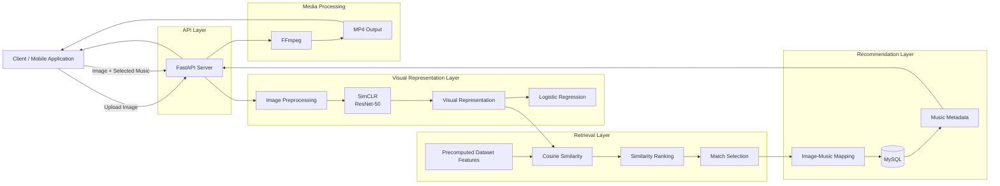
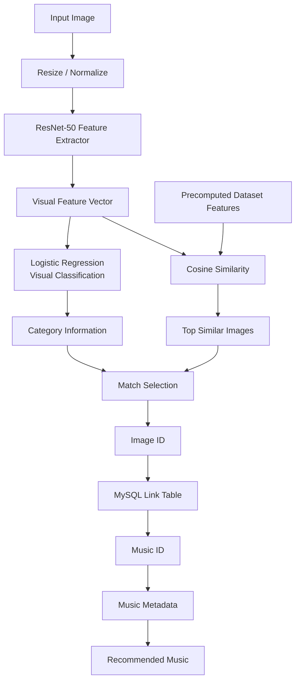
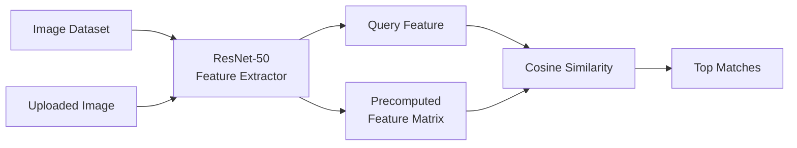
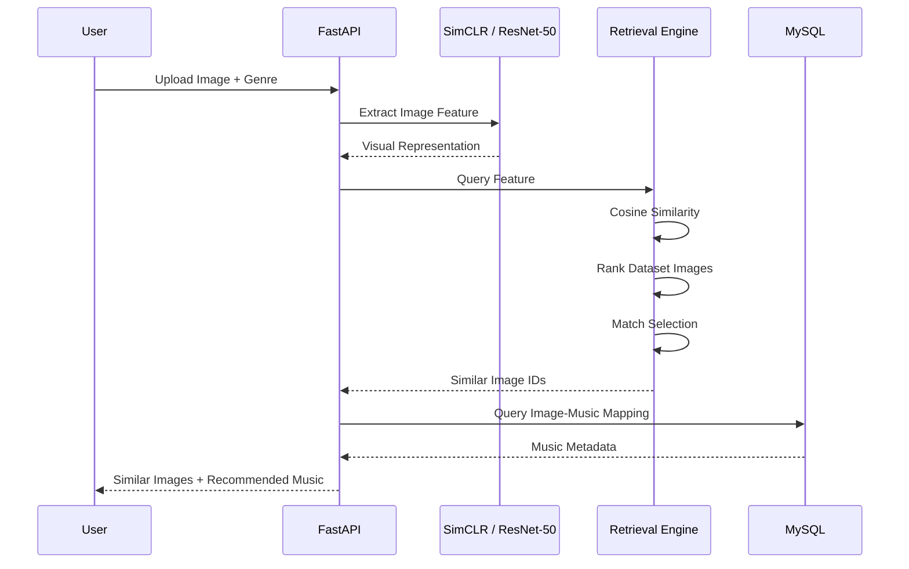
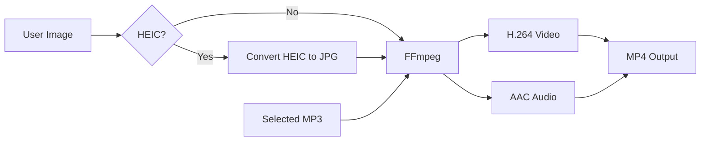
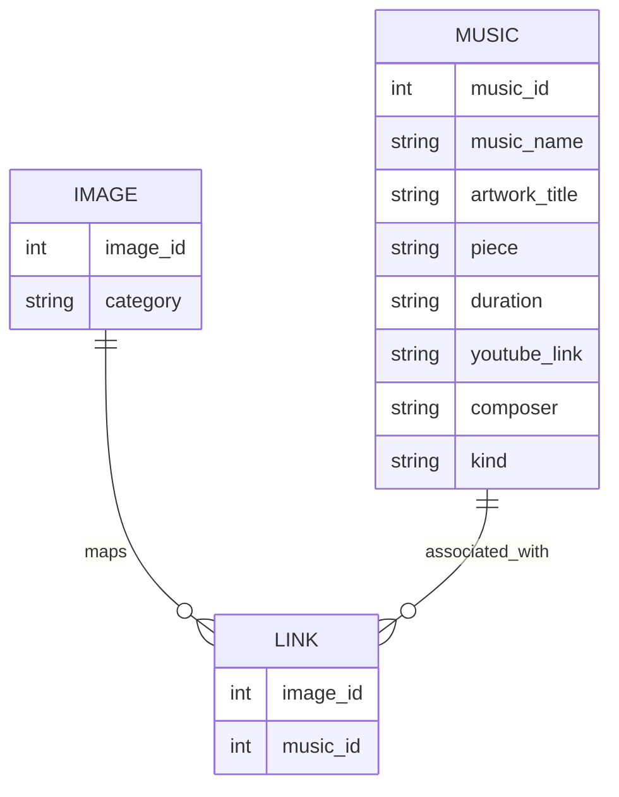

# PicTunesAPI

Visual Similarity-Based Image-to-Music Retrieval System using Contrastive Learning

PicTunes is an image-to-music recommendation system that explores the relationship between **visual content and music selection**.

Users can upload an image, and the system analyzes its visual representation through a contrastive learning model. Based on the extracted image features, PicTunes searches for visually similar images in a predefined dataset and retrieves music associated with those images.

The backend is implemented as a FastAPI service and integrates:

* Contrastive visual representation learning with SimCLR
* ResNet-50 feature extraction
* Image classification with Logistic Regression
* Cosine similarity-based image retrieval
* Image-to-music mapping through MySQL
* Anime / Movie music recommendation
* HEIC image processing
* Image and audio composition with FFmpeg
* RESTful API for client integration

---

# System Preview

> 此區建議放置 PicTunes App 的實際操作流程，讓瀏覽者可以在閱讀技術細節之前先理解系統成果。

## Image Upload

<!--

-->

使用者可以從裝置選擇圖片並上傳至 PicTunes。

建議展示：

* 圖片選擇畫面
* Anime / Movie 音樂類型選擇
* 上傳與分析狀態

---

## Music Recommendation

<!--

-->

系統分析影像後，回傳與輸入圖片具有相似視覺特徵的參考影像，以及這些影像所對應的音樂。

建議展示：

* 輸入圖片
* 相似圖片
* Similarity Score
* 推薦音樂
* Composer
* Artwork / Piece
* YouTube Link

---

## Media Generation

<!--

-->

使用者選擇推薦音樂後，系統可以將：

```text
Image
  +
Selected Music
  |
  v
MP4 Video
```

整合成可播放的影音內容。

---

# Project Motivation

圖片與音樂是社群媒體與數位內容中最常被共同使用的兩種媒體。

然而，當使用者希望為一張圖片搭配適合的音樂時，通常仍需要：

```text
Understand the image
        |
        v
Imagine an appropriate atmosphere
        |
        v
Search for music manually
        |
        v
Preview multiple tracks
        |
        v
Select the final music
```

這個流程高度依賴個人經驗，也需要花費時間進行搜尋。

PicTunes 因此希望探索：

> Can visual representation be used to assist music retrieval?

本專案首先從視覺內容出發，透過 Contrastive Learning 建立影像 representation，再利用相似圖片與預先建立的 Image–Music 關聯資料進行音樂檢索。

整體概念：

```text
Input Image
    |
    v
Understand Visual Content
    |
    v
Retrieve Similar Images
    |
    v
Find Associated Music
    |
    v
Recommend Music
```

PicTunes 將原本需要人工完成的「看圖片、理解內容、尋找配樂」流程轉化為可透過模型與資料庫自動處理的推薦系統。

---

# System Architecture

PicTunesAPI 可分成四個主要部分：

1. API Layer
2. Visual Representation Layer
3. Retrieval and Recommendation Layer
4. Media Processing Layer



---

# Core Recommendation Pipeline

PicTunes 的核心推薦流程並不是直接將圖片與音樂映射到同一個 embedding space。

目前系統採用兩階段方法：

```text
Stage 1
Visual Similarity Retrieval

Stage 2
Image-to-Music Association
```

完整流程：



也就是：

```text
Image
  |
  v
Visual Representation
  |
  v
Similar Image Retrieval
  |
  v
Image-Music Mapping
  |
  v
Music Recommendation
```

這樣的設計讓系統可以先處理較容易建立 supervision 的 visual similarity，再利用已建立的 Image–Music correspondence 完成跨媒體推薦。

---

# Visual Representation Learning

## SimCLR

PicTunes 使用 SimCLR 作為影像 representation learning 的核心方法。

SimCLR 是一種 Contrastive Learning 方法，目標不是直接學習分類標籤，而是讓同一張圖片經過不同 augmentation 後所產生的 representation 在 embedding space 中更加接近。

概念如下：

```text
Original Image
    |
    +----------------+
    |                |
    v                v
Augmentation A   Augmentation B
    |                |
    v                v
Encoder          Encoder
    |                |
    v                v
Representation A Representation B
         \          /
          \        /
           v      v
        Contrastive
          Learning
```

訓練目標為：

```text
Positive Pair
Same image under different transformations
        |
        v
Representation should be closer


Negative Pair
Different images
        |
        v
Representation should be farther apart
```

透過 Contrastive Learning，可以讓模型學習不只依賴人工類別標籤的視覺 representation。

---

# SimCLR Architecture

本專案的 SimCLR Encoder 使用：

```text
ResNet-50
```

並搭配 projection head：

```text
ResNet-50
    |
    v
Feature Representation
    |
    v
Linear
    |
    v
ReLU
    |
    v
Linear
    |
    v
Projection Space
```

模型架構：


SimCLR 訓練使用 InfoNCE-style contrastive objective，透過 cosine similarity 衡量 representations 之間的關係。

---

# Contrastive Learning Objective

對同一張圖片產生兩個不同 augmentation：

```text
xi -> Encoder -> zi
xj -> Encoder -> zj
```

其中 `(zi, zj)` 為 Positive Pair。

其他 batch samples 則作為 Negative Pairs。

模型希望最大化：

```text
similarity(zi, zj)
```

同時降低：

```text
similarity(zi, zk)

where k != j
```

本專案使用 cosine similarity：

```text
                  A · B
cos(A, B) = -----------------
             ||A|| × ||B||
```

作為 representation similarity 的基礎。

---

# Image Classification

除了 Contrastive Representation Learning，PicTunes 亦在 learned visual features 上加入 Logistic Regression classifier。

架構：

```text
Input Image
    |
    v
ResNet-50 Feature Extractor
    |
    v
Visual Feature
    |
    v
Linear Classifier
    |
    v
Visual Category
```

目前資料集包含五種主要 visual categories：

| Category     | Description |
| ------------ | ----------- |
| Architecture | 建築與城市相關影像   |
| Food         | 食物與餐飲影像     |
| Landscape    | 自然與景觀影像     |
| Outfit       | 穿搭與服飾影像     |
| Sports       | 運動相關影像      |

資料結構：

```text
dataset/
│
├── Architecture/
├── Food/
├── Landscape/
├── Outfit/
└── Sports/
```

分類資訊除了可以描述輸入影像的主要 visual context，也可以輔助後續 similarity retrieval 的結果選擇。

---

# Feature Extraction

在 retrieval 階段，系統會使用訓練完成的 SimCLR Backbone 作為 feature extractor。

概念：

```text
Trained SimCLR
      |
      v
Remove Projection Head
      |
      v
ResNet-50 Backbone
      |
      v
Visual Feature Vector
```

輸入圖片經過：

```text
Resize
  |
256 × 256
  |
Tensor
  |
Normalization
  |
ResNet-50
```

取得 visual representation。

---

# Precomputed Feature Retrieval

如果每次收到使用者圖片後，都重新對整個 dataset 執行 feature extraction：

```text
User Request
    |
    v
Encode Input Image
    |
    v
Encode Dataset Image 1
    |
    v
Encode Dataset Image 2
    |
    v
...
    |
    v
Similarity Search
```

將產生大量重複計算。

因此 PicTunes 在系統初始化時先對 dataset 中的影像進行 feature precomputation。



將推薦階段轉化為：

```text
Input Feature
      |
      v
Compare with
Precomputed Features
      |
      v
Similarity Ranking
```

避免每次 Request 都重新抽取整個 dataset 的 representation。

---

# Similarity Search

取得輸入圖片的 feature vector 後，系統會與 dataset 中預先計算的 features 執行 cosine similarity。

```text
Input Feature
      |
      +---------------------------+
      |            |              |
      v            v              v
Dataset F1     Dataset F2     Dataset Fn
      |            |              |
      v            v              v
   Similarity   Similarity      Similarity
      \            |             /
       \           |            /
        +----------+-----------+
                   |
                   v
              Sort Descending
                   |
                   v
               Top Matches
```

首先取得 similarity 最高的 Top-10 image candidates。

接著根據候選圖片的 visual categories 進一步進行 match selection，最後選出推薦候選。

---

# Image-to-Music Mapping

目前 PicTunes 並不是直接計算：

```text
Image Embedding
      vs
Music Embedding
```

而是利用 dataset 中已建立的 Image–Music Association。

概念：


資料庫中的關聯概念：

```text
Image Table
     |
  image_id
     |
     v
Link Table
     |
  music_id
     |
     v
Music Table
```

如此即可將：

```text
Visual Similarity
```

轉換為：

```text
Music Recommendation
```

---

# Music Recommendation Domain

目前 Backend 支援兩種音樂來源：

```text
Anime
Movie
```

資料結構：

```text
Music_Data/
│
├── Anime/
│
└── Movie/
```

API 根據使用者選擇的 genre，在對應的 Database 中取得 music metadata。

推薦結果包含：

```text
Music ID
Music Name
Artwork Title
Piece
Duration
YouTube Link
Composer
Kind
```

---

# End-to-End Recommendation Flow

完整的 Image-to-Music Retrieval 可以表示為：



---

# API Recommendation Flow

主要推薦 API：

```http
POST /upload
```

Request：

```text
multipart/form-data
```

Fields：

```text
image: Uploaded Image
genre: Anime | Movie
```

處理流程：

```text
POST /upload
      |
      v
Temporary Image Storage
      |
      v
Image Preprocessing
      |
      v
SimCLR Feature Extraction
      |
      v
Cosine Similarity Search
      |
      v
Candidate Selection
      |
      v
Image ID Extraction
      |
      v
MySQL Query
      |
      v
Music Metadata
      |
      v
JSON Response
```

概念回傳格式：

```json
{
  "status": "success",
  "matches": [
    {
      "similarity": 0.93,
      "filename": "30051",
      "class": "Sports",
      "image_url": "/image/Sports/30051.jpg",
      "music_match": {
        "music_id": 1,
        "music_name": "...",
        "artwork_title": "...",
        "piece": "...",
        "duration": "...",
        "youtube_link": "...",
        "composer": "...",
        "kind": "..."
      }
    }
  ]
}
```

---

# Media Generation

除了推薦音樂之外，PicTunesAPI 也可以直接將圖片與使用者選擇的音樂合成為影片。

API：

```http
POST /media_merger/
```

處理流程：



FFmpeg 將單張圖片建立成與音樂相同 duration 的影片：

```text
Image
   |
   +--------------+
                  |
                  v
               FFmpeg
                  ^
                  |
   +--------------+
   |
Music
```

Video：

```text
H.264
```

Audio：

```text
AAC
```

Output：

```text
MP4
```

---

# HEIC Support

考慮到 iPhone 拍攝照片經常使用 HEIC 格式，PicTunesAPI 透過：

```text
pillow-heif
```

處理 HEIC 圖片。

Media pipeline：

```text
HEIC
 |
 v
Decode
 |
 v
JPEG
 |
 v
FFmpeg
 |
 v
MP4
```

因此行動裝置可以直接使用相機拍攝的照片進行後續影音生成。

---

# Backend Architecture

PicTunesAPI 使用 FastAPI 作為 Backend Framework。

```text
Client
  |
  | HTTP / Multipart Form
  v
FastAPI
  |
  +-----------------------+
  |                       |
  v                       v
AI Inference          Media Processing
  |                       |
  v                       v
SimCLR                  FFmpeg
  |
  v
Retrieval
  |
  v
MySQL
  |
  v
Music Metadata
```

FastAPI 主要負責：

* Image Upload
* AI Model Inference
* Similarity Retrieval
* Database Integration
* Image Serving
* Music Recommendation
* Media Processing
* Generated File Response

---

# Database Architecture

Backend 透過 `mysql-connector-python` 連接 MySQL。

目前系統將 Anime 與 Movie music sources 分別管理。

概念架構：



Similarity Search 得到 reference image 後，系統透過其 `image_id` 查詢 link table，再取得相對應的 music metadata。

---

# Technology Stack

| Layer                   | Technology             | Purpose                           |
| ----------------------- | ---------------------- | --------------------------------- |
| Language                | Python                 | Backend and ML development        |
| API                     | FastAPI                | RESTful API                       |
| Deep Learning           | PyTorch                | Model inference                   |
| Training Framework      | PyTorch Lightning      | Model architecture and training   |
| Visual Encoder          | ResNet-50              | Image feature extraction          |
| Representation Learning | SimCLR                 | Contrastive visual representation |
| Classifier              | Logistic Regression    | Visual category classification    |
| Retrieval               | Cosine Similarity      | Similar image search              |
| Computer Vision         | Torchvision            | Image model and transformations   |
| Image Processing        | Pillow                 | Image processing                  |
| HEIC Processing         | pillow-heif            | iPhone image support              |
| Database                | MySQL                  | Image-music relationship          |
| Database Client         | mysql-connector-python | MySQL connection                  |
| Media Processing        | FFmpeg                 | Image-audio video generation      |
| Numerical Computing     | NumPy                  | Data processing                   |

---

# Repository Structure

```text
PicTunesAPI/
│
├── app/
│   │
│   ├── SimCLRAnalyse.py
│   ├── MediaMerger.py
│   │
│   ├── simclr_model_*.pt
│   └── logreg_model_*.pt
│
├── dataset/
│   │
│   ├── Architecture/
│   ├── Food/
│   ├── Landscape/
│   ├── Outfit/
│   └── Sports/
│
├── Music_Data/
│   │
│   ├── Anime/
│   └── Movie/
│
├── saved_models/
│   │
│   ├── SimCLR.ckpt
│   ├── ResNet.ckpt
│   ├── LogisticRegression_*.ckpt
│   └── tensorboards/
│
├── main.py
├── requirements.txt
└── secret.yaml
```

---

# RESTful API

## Service Status

```http
GET /
```

Returns basic API information.

```http
GET /health/
```

Health check endpoint.

```http
GET /dbcon_check/
```

Checks Anime and Movie database connections.

---

## Image Analysis and Music Retrieval

```http
POST /upload
```

Performs:

```text
Image Upload
  ->
Feature Extraction
  ->
Similarity Retrieval
  ->
Music Mapping
  ->
Recommendation
```

---

## Dataset Image

```http
GET /image/{class_name}/{filename}
```

Returns a matched reference image from the visual dataset.

---

## Media Generation

```http
POST /media_merger/
```

Combines an uploaded image and selected music into an MP4 video.

---

## Media Cleanup

```http
GET /media_merger/cleanup/
```

Removes generated temporary media files.

---

# Technical Highlights

## 1. Contrastive Visual Representation Learning

Rather than relying only on supervised image labels, PicTunes applies SimCLR to learn visual representations through contrastive learning.

```text
Image
  ->
Augmentation
  ->
ResNet-50
  ->
Contrastive Learning
  ->
Visual Representation
```

This representation is reused for downstream classification and retrieval.

---

## 2. Classification and Retrieval Combination

PicTunes does not treat image classification as the final result.

Instead:

```text
Classification
      +
Similarity Retrieval
      +
Image-Music Mapping
      =
Music Recommendation
```

Classification provides semantic information about visual content, while nearest-neighbor retrieval preserves instance-level visual similarity.

---

## 3. Precomputed Feature Search

Dataset representations are generated before user queries are processed.

This changes the online inference problem from:

```text
Encode Query
+
Encode Entire Dataset
+
Compare
```

into:

```text
Encode Query
+
Compare with Cached Representations
```

reducing repeated feature extraction during recommendation requests.

---

## 4. Content-Based Retrieval

The system retrieves recommendations based on visual features rather than relying on user profiles or interaction histories.

Therefore PicTunes can perform recommendations for previously unseen users without requiring:

```text
User History
Ratings
Listening History
Social Graph
```

The recommendation starts directly from the uploaded visual content.

---

## 5. End-to-End Multimedia Pipeline

PicTunes is not limited to model inference.

The project integrates:

```text
Image Input
     |
AI Representation
     |
Similarity Retrieval
     |
Database Retrieval
     |
Music Recommendation
     |
Media Processing
     |
Video Output
```

covering the complete workflow from AI analysis to a user-consumable multimedia result.

---

# Engineering Considerations

## Model Initialization

Models are loaded when the SimCLR analysis module initializes:

```text
Application Startup
      |
      v
Load SimCLR Model
      |
      v
Load Logistic Regression
      |
      v
Precompute Dataset Features
      |
      v
Ready for Requests
```

This avoids reloading the models for every API request.

---

## Temporary File Management

Uploaded images are temporarily stored for processing and removed after inference.

```text
Upload
  |
Temporary Storage
  |
Processing
  |
Response
  |
Cleanup
```

Generated videos can also be removed through a dedicated cleanup endpoint.

---

## Device Selection

Model inference checks for Apple Metal Performance Shaders support.

```text
MPS Available?
   |
   +-- Yes -> MPS
   |
   +-- No  -> CPU
```

allowing development and inference acceleration on compatible Apple hardware.

---

# What I Learned

PicTunes allowed me to integrate concepts from machine learning, backend development, database design, and multimedia processing into a complete application.

The development process covered:

```text
Problem Definition
        |
        v
Dataset Construction
        |
        v
Representation Learning
        |
        v
Model Training
        |
        v
Feature Extraction
        |
        v
Similarity Retrieval
        |
        v
Database Mapping
        |
        v
RESTful API
        |
        v
Client Integration
        |
        v
Media Generation
```

The project provided practical experience in:

* Contrastive Learning
* SimCLR
* Representation Learning
* ResNet
* PyTorch
* PyTorch Lightning
* Image Classification
* Content-Based Retrieval
* Cosine Similarity
* Feature Precomputation
* RESTful API Design
* FastAPI
* MySQL Integration
* Image Processing
* HEIC Processing
* FFmpeg Multimedia Processing

---

# Current System and Research Limitation

The current PicTunes architecture retrieves music indirectly:

```text
Input Image
      |
      v
Image Embedding
      |
      v
Similar Reference Images
      |
      v
Image-Music Mapping
      |
      v
Recommended Music
```

This approach successfully connects visual similarity with music recommendation, but image and music are **not yet represented in a unified cross-modal embedding space**.

In other words, the current system optimizes:

```text
Image
  ->
Image
```

similarity first, and then obtains:

```text
Image
  ->
Music
```

through predefined associations.

Therefore, the quality of music retrieval still depends on how well visual similarity reflects the semantic or affective relationship between an image and a piece of music.

This limitation also provides a clear direction for further research.

---

# Research Extension

A natural extension of PicTunes is to transform the current two-stage retrieval architecture into direct cross-modal retrieval.

## Current Architecture

```text
Image Query
    |
    v
Visual Representation
    |
    v
Image-to-Image Retrieval
    |
    v
Database Mapping
    |
    v
Music
```

## Future Cross-Modal Architecture

```text
                Shared Embedding Space

Image --------> Visual Encoder ----+
                                   |
                                   v
                              Representation
                                   ^
                                   |
Music --------> Audio Encoder -----+

                     |
                     v
              Cross-Modal Retrieval
                     |
                     v
                Matched Music
```

The objective becomes:

```text
Image -> Music Retrieval
```

directly, instead of:

```text
Image -> Similar Image -> Music
```

This creates opportunities to further investigate:

* Visual-Audio Shared Embedding Space
* Cross-Modal Representation Learning
* Image-to-Music Retrieval
* Audio Representation Learning
* Contrastive Cross-Modal Learning
* Neighborhood-Aware Representation Learning
* Retrieval Ranking Optimization

PicTunes therefore serves not only as an application prototype, but also as a foundation for exploring more advanced multimodal retrieval methods.

---

# Future Work

```text
[Completed] SimCLR Visual Representation Learning
[Completed] ResNet-50 Feature Extraction
[Completed] Logistic Regression Classification
[Completed] Five Visual Categories
[Completed] Precomputed Dataset Features
[Completed] Cosine Similarity Retrieval
[Completed] Image-Music Database Mapping
[Completed] Anime / Movie Recommendation
[Completed] FastAPI Backend
[Completed] MySQL Integration
[Completed] HEIC Support
[Completed] Image-Audio MP4 Generation

[Research] Visual-Audio Shared Embedding Space
[Research] Direct Image-to-Music Retrieval
[Research] Cross-Modal Contrastive Learning
[Research] Neighborhood-Aware Cross-Modal Representation
[Research] Retrieval Evaluation and Ranking Metrics

[Engineering] Vector Database / ANN Search
[Engineering] Batch Feature Persistence
[Engineering] GPU Deployment
[Engineering] Docker Deployment
[Engineering] Automated Testing
[Engineering] CI/CD
```

---

# Getting Started

## Clone Repository

```bash
git clone https://github.com/PicTunes/PicTunesAPI.git
cd PicTunesAPI
```

---

## Install Dependencies

建議使用 Python virtual environment：

```bash
python3 -m venv .venv
source .venv/bin/activate
```

安裝 Python dependencies：

```bash
pip install -r requirements.txt
```

主要 dependencies 包含：

```text
FastAPI
Uvicorn
PyTorch
Torchvision
PyTorch Lightning
scikit-learn
MySQL Connector
Pillow
pillow-heif
FFmpeg Python
NumPy
```

系統另外需要安裝 FFmpeg executable。

---

# Database Configuration

---

# Repository

GitHub Repository:

```text
https://github.com/PicTunes/PicTunesAPI
```

---

# Project Summary

PicTunes demonstrates an end-to-end content-based multimedia retrieval pipeline:

```text
Visual Input
     |
Representation Learning
     |
Feature Extraction
     |
Similarity Retrieval
     |
Cross-Media Association
     |
Music Recommendation
     |
Multimedia Generation
```

Rather than treating the machine learning model as an isolated experiment, the project integrates model inference with API services, databases and media processing to build a complete image-to-music recommendation prototype.

The current system also establishes a practical baseline for future research toward direct visual-audio cross-modal retrieval.
